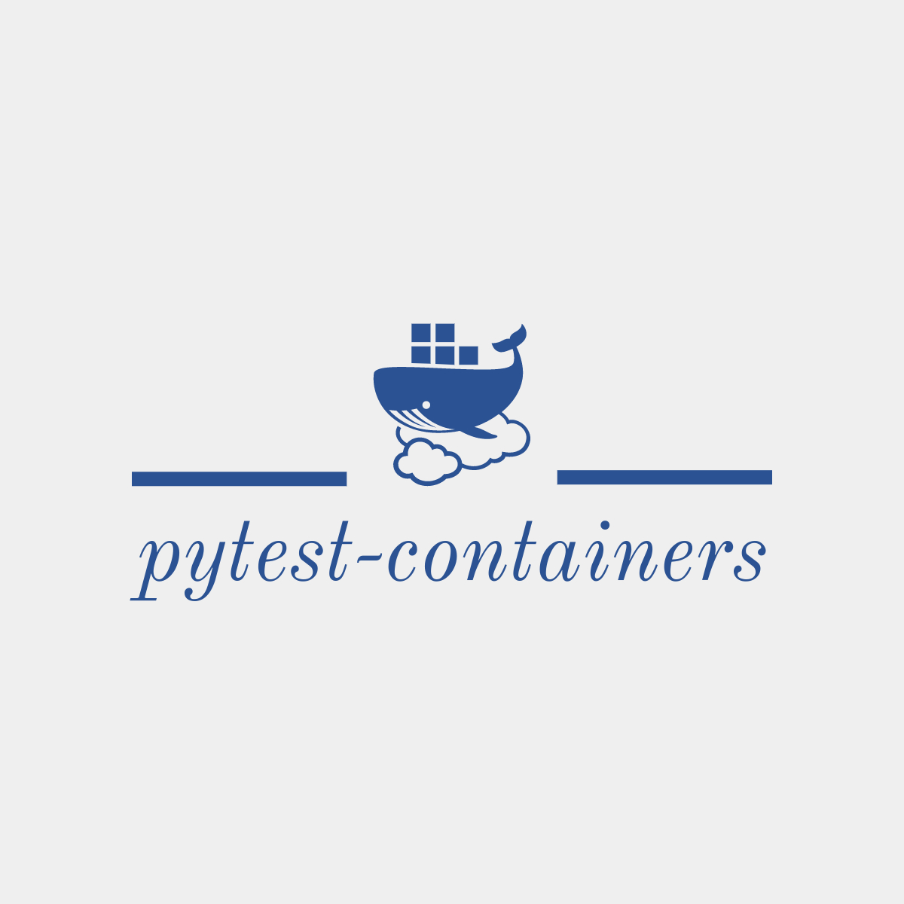

========
pytest-containers
========

.. image:: https://img.shields.io/pypi/v/pytest-containers.svg
        :target: https://pypi.python.org/pypi/pytest-containers

## pytest-containers:
A pytest plugin for spinning up docker compose services as dependencies of tests
